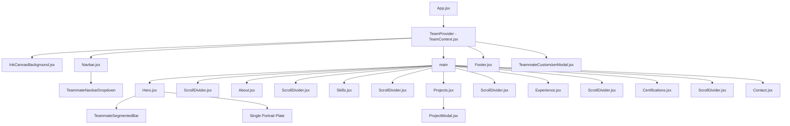
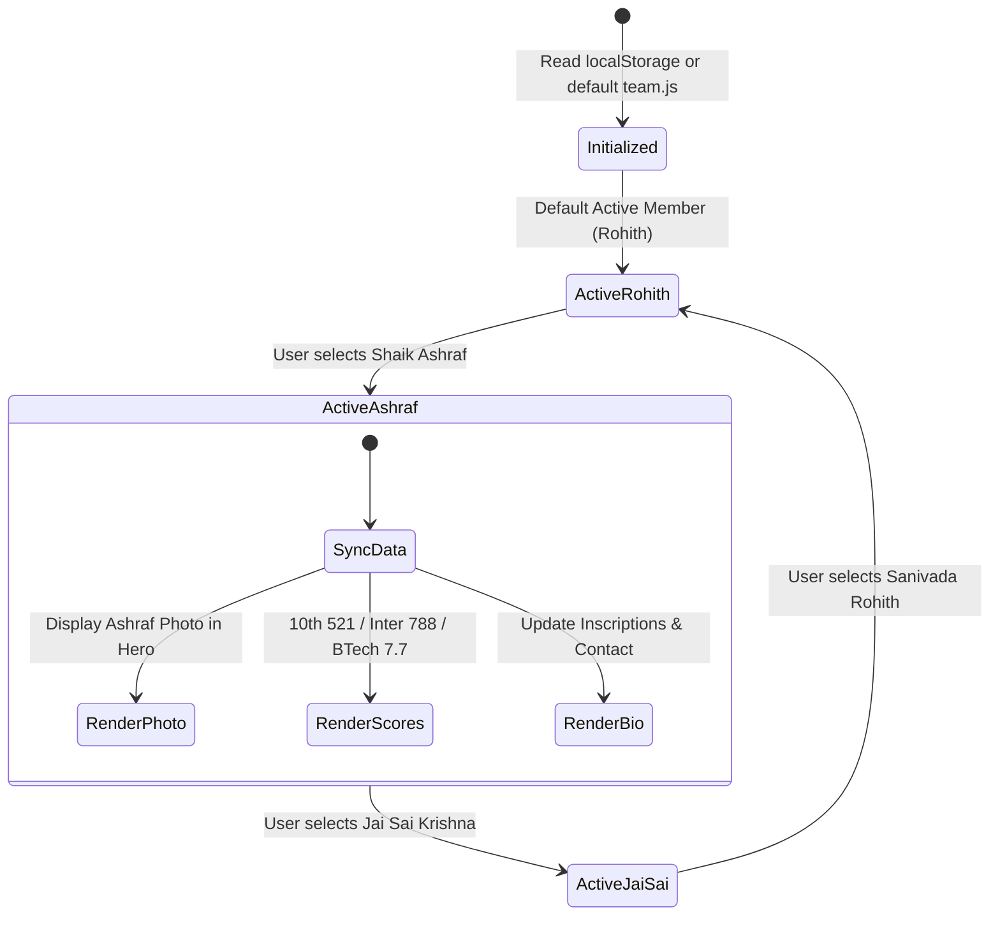

# 📘 Comprehensive Technical Documentation & Architecture Manual

## 1. Executive Summary
This document provides complete technical documentation for the **KL University B.Tech CSE Team Portfolio Web Application**. It outlines the full architectural model, component hierarchy, state distribution, data schemas, and user interaction mechanics.

---

## 2. Technology Stack & Environment
- **Core Runtime**: Node.js >= 18.0.0
- **Frontend Library**: React 19 (`react`, `react-dom`)
- **Language**: ECMAScript Modules (JavaScript ES2022 / JSX)
- **Styling Architecture**: Tailwind CSS v4 (`@tailwindcss/vite`, `tailwindcss`)
- **Icons & Visual Semiotics**: Lucide React (`lucide-react`)
- **Animation Primitives**: HTML5 2D Canvas Context API & CSS transitions
- **Audio Synthesizer**: Web Audio API (OscillatorNode, GainNode, Convolver)
- **Build Engine & Dev Server**: Vite 8

---

## 3. Directory Layout & Module Responsibilities

| Path | Format | Responsibility |
|---|---|---|
| `index.html` | HTML5 | Root document housing metadata, Google Fonts preconnect, and root mounting node |
| `vite.config.js` | ESM JS | Vite configuration integrating Tailwind CSS and React plugin |
| `src/main.jsx` | JSX | Application bootstrap rendering `<App />` within `StrictMode` |
| `src/App.jsx` | JSX | Master shell arranging background, navigation, chapters, modals, and footer |
| `src/context/TeamContext.jsx` | JSX | React Context provider managing the team roster, active member state, and localStorage |
| `src/data/team.js` | JS | Canonical source of truth for the 3 team members (Rohith, Ashraf, Jai Sai) |
| `src/data/projects.js` | JS | Structured dataset describing all academic and software engineering projects |
| `src/data/skills.js` | JS | Categorized technical competencies and proficiency levels |
| `src/data/experience.js` | JS | Scholastic milestones (10th, Intermediate, B.Tech) and project timeline |
| `src/data/certifications.js` | JS | Cloud computing accreditations and credential URLs |
| `src/components/background/InkCanvasBackground.jsx` | JSX | Canvas animation featuring connecting particle constellation and code tokens |
| `src/components/team/TeammateSelector.jsx` | JSX | Interactive selector bar and navbar dropdown |
| `src/components/team/TeammateCustomizerModal.jsx` | JSX | Modal form for in-browser editing of candidate details and profile photos |
| `src/components/sections/Hero.jsx` | JSX | Hero chapter featuring candidate title, credentials, and solitary portrait plate |
| `src/components/sections/About.jsx` | JSX | Candidate manuscript bio and academic scorecard |
| `src/components/sections/Skills.jsx` | JSX | Categorized skills tabs with filterable controls |
| `src/components/sections/Projects.jsx` | JSX | Grid of artifact cards with live demonstration triggers |
| `src/components/sections/ProjectModal.jsx` | JSX | Deep-dive modal inspecting system architecture and problem resolutions |
| `src/components/sections/Experience.jsx` | JSX | Chronological Odyssey milestone spine |
| `src/components/sections/Certifications.jsx` | JSX | Verified certificates and registry records |
| `src/components/sections/Contact.jsx` | JSX | Direct channels (email, phone, LinkedIn, GitHub) and communique dispatch form |
| `src/components/layout/Navbar.jsx` | JSX | Fixed header with scroll observer, navigation links, and audio control |
| `src/components/layout/Footer.jsx` | JSX | Archival footer with back-to-top trigger and team credits |
| `src/utils/audio.js` | JS | Audio synthesizer generating chime chords and brush sounds |

---

## 4. Visual Workflow Diagrams

### 4.1 Component Hierarchy & Data Flow



### 4.2 Teammate Switching State Machine



---

## 5. Non-Technical Execution Handbook

### 5.1 Environment Setup
1. **Node.js**: Verify installation by opening Command Prompt / PowerShell and running:
   ```bash
   node -v
   ```
   *Expected output*: `v18.x.x` or `v20.x.x` or `v22.x.x`.

2. **VS Code**:
   - Open Visual Studio Code.
   - Go to `File` -> `Open Folder...`.
   - Select the directory `c:\Users\navee\Desktop\Rohit's Portfolio`.

### 5.2 Starting Development Server
1. Press `` Ctrl + ` `` in VS Code to open the terminal.
2. Ensure dependencies are present:
   ```bash
   npm install
   ```
3. Run the development server:
   ```bash
   npm run dev
   ```
4. Hold `Ctrl` and click the URL printed in the terminal (usually `http://localhost:5173/`).

### 5.3 Building for Production
To generate a production deployment package:
```bash
npm run build
```
The output files will be created in the `dist/` directory.
