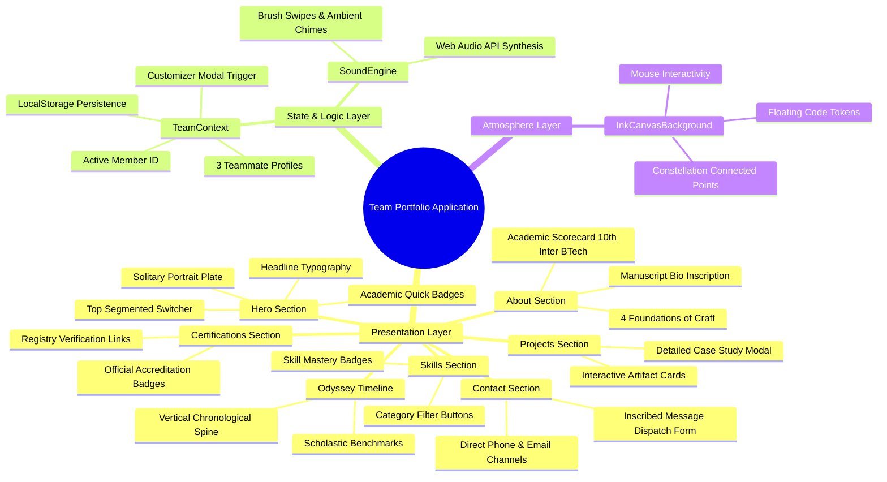
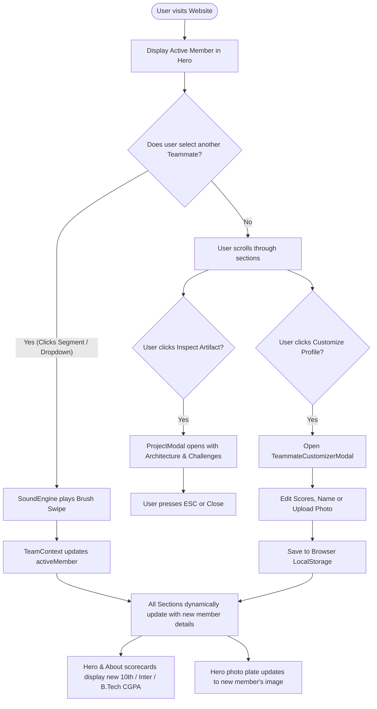
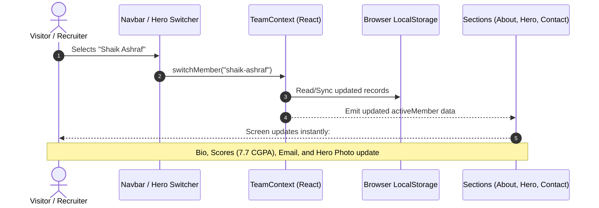

# 🌟 Academic Team Portfolio — KL University (B.Tech CSE)

> A modern, responsive, high-performance web portfolio engineered for a **3-member software engineering team** at **KL University**. Built with **React 19**, **Vite**, **Tailwind CSS v4**, and smooth interactive canvas animations.

---

## 📌 Table of Contents
1. [Overview](#-overview)
2. [Team Members](#-team-members)
3. [Key Features](#-key-features)
4. [Project Architecture & Folder Structure](#-project-architecture--folder-structure)
5. [Mindmaps & Workflow Diagrams](#-mindmaps--workflow-diagrams)
   - [System Architecture Mindmap](#1-system-architecture-mindmap)
   - [User Interaction & State Workflow](#2-user-interaction--state-workflow)
   - [Data Flow Diagram](#3-data-flow-diagram)
6. [Non-Tech Beginner's Guide: How to Run Step-by-Step](#-non-tech-beginners-guide-how-to-run-step-by-step)
   - [Prerequisites](#step-0-prerequisites-what-you-need-installed)
   - [Step 1: Open VS Code & Open Folder](#step-1-open-vs-code-and-open-the-project-folder)
   - [Step 2: Open the Built-in Terminal](#step-2-open-the-built-in-terminal)
   - [Step 3: Install Dependencies](#step-3-install-the-project-packages)
   - [Step 4: Start the Local Development Server](#step-4-start-the-local-development-server)
   - [Step 5: View the Application in Your Browser](#step-5-view-the-website-in-your-browser)
   - [Step 6: How to Stop the Server](#step-6-how-to-stop-the-server)
7. [How to Customize Team Details & Photos](#-how-to-customize-team-details--photos)
8. [Building for Production & Deployment](#-building-for-production--deployment)

---

## 📖 Overview

This portfolio showcases the academic achievements, technical projects, certifications, and developer profiles of 3 computer science undergraduates. The website features an architectural warm shaded theme (`#EAEAE7`), interactive constellation canvas nodes, audio chimes, and instant live switching between team members without page reload.

---

## 👥 Team Members

The application manages data for 3 team members:

| # | Name | Specialization / Title | Academic Scores (10th / Inter / B.Tech) | Contact |
|---|------|------------------------|-----------------------------------------|---------|
| **1** | **Sanivada Rohith** | Full-Stack Developer & Software Architect | 489 / 600 • 909 / 1000 • **6.9 CGPA** | `sanivadarohith1@gmail.com` • `+91 83414 26989` |
| **2** | **Shaik Ashraf** | Cloud Architecture & Backend Engineer | 521 / 600 • 788 / 1000 • **7.7 CGPA** | `shaikashraf9703@gmail.com` • `+91 99638 73366` |
| **3** | **Boyina Jai Sai Krishna** | Frontend Specialist & UI Architect | 536 / 600 • 815 / 1000 • **7.4 CGPA** | `jaisaikrishnaboyina@gmail.com` • `+91 83414 26989` |

> 📷 **Single Photograph Rule**: Each teammate's photograph is displayed exclusively **once** in the Hero portrait plate to maintain a clean layout without duplicate images.

---

## ✨ Key Features

- 🔄 **Dynamic Teammate Switcher**: Switch between team members using the segmented top bar or the dropdown in the navigation bar.
- 🎨 **Warm Shaded Architectural Theme**: Soft background (`#EAEAE7`, `#F1F1EE`) designed to eliminate glare.
- 🌌 **Constellation Background Canvas**: Interactive HTML5 Canvas animation connecting glowing nodes and floating developer code symbols (`</>`, `{ }`, `const`, `return`, `git`).
- 📊 **Academic Scorecards**: Displays 10th grade, Intermediate, and B.Tech CGPA benchmarks dynamically for whichever member is active.
- 📝 **Live Profile Customizer**: Interactive modal to customize names, scores, taglines, and upload custom profile images locally.
- ⚡ **Pure React JSX (.jsx / .js)**: Fast bundling using Vite without TypeScript compile overhead.
- 📱 **Fully Responsive**: Optimized for smartphones, tablets, laptops, and ultra-wide screens.

---

## 📁 Project Architecture & Folder Structure

```text
Rohit's Portfolio/
│
├── public/                               # Static public assets
│   ├── favicon.svg                       # Browser tab icon
│   └── images/                           # Teammate photographs
│       ├── rohit-photo.jpeg              # Sanivada Rohith's portrait
│       ├── ashraf-photo.jpeg             # Shaik Ashraf's portrait
│       └── jaisai-photo.jpeg             # Boyina Jai Sai Krishna's portrait
│
├── src/                                  # Application Source Code (Pure React JSX)
│   ├── main.jsx                          # Main entry point mounting the React app
│   ├── App.jsx                           # Root component coordinating all sections
│   ├── index.css                         # Global CSS & Tailwind design tokens
│   │
│   ├── context/                          # Global React State Management
│   │   └── TeamContext.jsx               # Team state, active member switcher, local storage
│   │
│   ├── data/                             # Centralized Data Records (Pure JavaScript)
│   │   ├── team.js                       # 3 Team members' bios, scores, photos & details
│   │   ├── projects.js                   # Project showcase catalog with modal details
│   │   ├── skills.js                     # Categorized technical competencies
│   │   ├── experience.js                 # Chronological education & milestone timeline
│   │   ├── certifications.js             # Cloud & industry accreditations
│   │   └── personal.js                   # Shared university & personal metadata
│   │
│   ├── components/                       # Modular UI Components
│   │   ├── background/
│   │   │   └── InkCanvasBackground.jsx   # Interactive constellation + code token canvas
│   │   │
│   │   ├── common/                       # Reusable UI elements
│   │   │   ├── KanjiWatermark.jsx        # Subtle chapter number watermarks
│   │   │   ├── RedSeal.jsx               # Traditional monogram identity stamp
│   │   │   ├── ScrollDivider.jsx         # Section transition dividing lines
│   │   │   ├── SectionHeading.jsx        # Standardized chapter headers
│   │   │   └── SocialIcons.jsx           # SVG icons (GitHub, LinkedIn)
│   │   │
│   │   ├── layout/                       # Structural Page Layout
│   │   │   ├── Navbar.jsx                # Fixed navigation header with quick switcher
│   │   │   └── Footer.jsx                # Footnote section with return-to-top button
│   │   │
│   │   ├── sections/                     # The 7 Primary Page Chapters
│   │   │   ├── Hero.jsx                  # Hero banner & solitary portrait plate
│   │   │   ├── About.jsx                 # Manuscript chronicle & Academic scorecard
│   │   │   ├── Skills.jsx                # Filterable skills tabs & arsenal cards
│   │   │   ├── Projects.jsx              # Artifacts grid with live links & modal view
│   │   │   ├── ProjectModal.jsx          # Deep-dive case study modal popup
│   │   │   ├── Experience.jsx            # The Odyssey vertical milestone timeline
│   │   │   ├── Certifications.jsx        # Official accredited credentials
│   │   │   └── Contact.jsx               # Direct email, phone, and dispatch inquiry form
│   │   │
│   │   └── team/                         # Team Management Components
│   │       ├── TeammateSelector.jsx      # Segmented switcher & navigation dropdown
│   │       └── TeammateCustomizerModal.jsx # In-browser editor to customize profiles & photos
│   │
│   └── utils/
│       └── audio.js                      # Web Audio API ambient chimes & brush effects
│
├── index.html                            # HTML foundation template
├── package.json                          # Project scripts and npm dependencies
├── vite.config.js                        # Vite bundler build configuration
└── README.md                             # Documentation & Setup Guide
```

---

## 📊 Mindmaps & Workflow Diagrams

### 1. System Architecture Mindmap



---

### 2. User Interaction & State Workflow



---

### 3. Data Flow Diagram



---

## 🚀 Non-Tech Beginner's Guide: How to Run Step-by-Step

Even if you have **never coded before**, follow these clear steps to run the website on your computer.

### Step 0: Prerequisites (What You Need Installed)
Make sure you have installed on your computer:
1. **Node.js**: Download and install the "LTS" version from [nodejs.org](https://nodejs.org/).
2. **Visual Studio Code (VS Code)**: Download from [code.visualstudio.com](https://code.visualstudio.com/).

---

### Step 1: Open VS Code and Open the Project Folder
1. Launch **Visual Studio Code** on your computer.
2. Click on **File** in the top-left menu bar.
3. Click on **Open Folder...** (or press `Ctrl + K`, then `Ctrl + O`).
4. Navigate to your project folder:
   ```text
   Desktop > Rohit's Portfolio
   ```
5. Click **Select Folder**.

---

### Step 2: Open the Built-in Terminal
1. At the top of VS Code, click on **Terminal** in the menu bar.
2. Click on **New Terminal** (or press the keyboard shortcut: `` Ctrl + ` `` — the backtick key next to the number 1).
3. A terminal window will open at the bottom of VS Code.

---

### Step 3: Install the Project Packages
In the terminal window, type the following command and press **Enter**:
```bash
npm install
```
- ⏳ *What happens*: This downloads all the necessary tools (React, Tailwind CSS, Lucide icons, Vite) into a folder named `node_modules`.
- It takes about 10–30 seconds. You will see a success message when it finishes.

---

### Step 4: Start the Local Development Server
Once `npm install` finishes, type the following command and press **Enter**:
```bash
npm run dev
```

You will see output similar to this:
```text
  VITE v8.3.1  ready in 240 ms

  ➜  Local:   http://localhost:5173/
  ➜  Network: use --host to expose
  ➜  press h + enter to show help
```

---

### Step 5: View the Website in Your Browser
1. In your terminal, hold the `Ctrl` key and click on the link: **`http://localhost:5173/`**
2. Alternatively, open Google Chrome (or Edge / Firefox), copy and paste `http://localhost:5173/` into the URL bar, and press **Enter**.
3. 🎉 **The portfolio website is now running live on your machine!**

---

### Step 6: How to Stop the Server
When you are done testing:
1. Click inside the VS Code terminal window.
2. Press **`Ctrl + C`** on your keyboard.
3. Type **`y`** (or press Enter) if prompted to terminate the batch job.

---

## 🛠️ How to Customize Team Details & Photos

You have **two ways** to customize details:

### Method A: Directly inside the Web Browser (No coding needed)
1. In the top navigation bar or next to the active member, click **"Customize Profile"** (wrench/slider icon).
2. A window will pop up where you can:
   - Change Name, Title, and University
   - Update 10th marks, Intermediate marks, or B.Tech CGPA
   - Upload a new photo directly from your computer
   - Edit phone number, email, and LinkedIn links
3. Click **"Save Changes"**. The details will be saved to your browser automatically.

### Method B: Directly in the Code
Open the file:
```text
src/data/team.js
```
You will find the data objects for each member:
```javascript
{
  id: 'sanivada-rohith',
  name: 'Sanivada Rohith',
  scores: {
    tenth: '489 / 600',
    intermediate: '909 / 1000',
    btech: '6.9 CGPA'
  },
  photo: '/images/rohit-photo.jpeg',
  ...
}
```
Simply edit any values and save the file (`Ctrl + S`). The website in your browser will update instantly without needing a manual refresh!

---

## 📦 Building for Production & Deployment

To create an optimized production bundle ready for hosting on Vercel, Netlify, or GitHub Pages:

```bash
npm run build
```

This compiles everything into a high-speed production folder:
```text
dist/
├── index.html
└── assets/
    ├── index-[hash].css
    └── index-[hash].js
```

### Deploying to Vercel
1. Push your repository to GitHub.
2. Log into [Vercel](https://vercel.com/) with GitHub.
3. Import this repository.
4. Leave build settings as default (`npm run build`, output directory `dist`).
5. Click **Deploy**.

---

## 📜 Credits & License
- Designed & Developed for **KL University Computer Science & Engineering Team**.
- Built with React, Vite, Tailwind CSS, Lucide Icons, and Canvas API.
